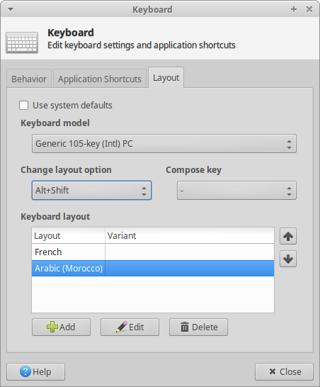

# ubuntu install
## Backup MBR
- backup HDDs MBRs
`# dd if=/dev/sda of=mbr_sda.bkp bs=512 count=1`
## Software installation
1. **install script:**
	execute install script
`code1`
1. **fix wifi dongle problem:**
	 edit  /etc/NetworkManager/NetworkManager.conf
		[device]
		wifi.scan-rand-mac-address=no
1. **homestruct and links:**
	1. links:
		1. Downloads
		1. Documents
		1. Pictures
		1. SLAVE_workspace, workspace
		1. VirtualBox VMs, vms,  vmresha
		1. repos
	1. mkdir:
		1. apps
		1. iso,  pdfs, vms etc.. in Downloads
1. **kutils:**
1. **namlat or rss-stuff:**
1. **ghosty-git:**
	[install ghosty-git](https://github.com/xaled/ghosty-git/blob/master/INSTALL.md "install ghosty-git")
1. **judo:**
	[install judo](# "install judo")
1. **autossh:**
	[install autossh](# "install autossh")
1. **Other apps:**
	1. VirtualBox
			sudo dpkg -i "virtualbox-5.2_5.2.4-119785~Ubuntu~zesty_amd64.deb"
		install  extension pack and create hostonly network.
	1. PyCharm
	1. Splunk
			 sudo  useradd splunk
		 copy splunk dir and splunks ( splunk_base, run_splunk.sh)

## Xubuntu Settings
1. **prefered applications:**
	
	`sudo apt-get remove mousepad`
1. **regional settings:**
	Language Support > Regional Formats > English (Iremand) > Applu System-Wide
1. **workspaces:**
	workspaces settings: number of workspaces 4
	workspaces switchers: number of rows 2
	
	
1. **panel and launchers:**
	[panels.md](panels.md)
1. **clock settings:**
	tooltip format: %A %d %B %Y
	panel 0 clock format:%R
	panel 1 clock format: %a %d %b %R
1. **Hotkeys:**
	1. super+D, super:
		keep Ctrl+Alt+D and Ctrl+Esc
	1. arabic layout + hotkey:
		
1. **wallpapers and avatar:**
	?
1. **terminal:**
	Edit > profile preferences > colors > white on black
1. **bookmarks:**
	1. SSH locations
	1. judo_downloads
	1. Storage
## Restore
1. **Firefox profiles:**
1. **Apps:**
1. **Vms, iso, dockers:**
1. **Templates, launchers:**
	- invert color launcher
	https://github.com/xaled/ubuntu-templates.git
1. **OLD, BACKUP:**
1. **judo profiles:**
1. **dockers, startup, crons:**
1. **Desktop**
1.  quiterss
1. clean backup

## Host specific
### Nexspirited
### Inspirited
### OptiplexSpirited
### Oraspirited
### mOraspirited
